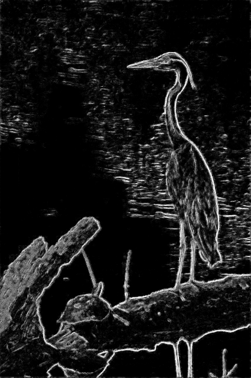

# Graph-based image gradient (GIG)

Python implementation to compute gradients using the GIG method, originally published as:

> **Descriptive Image Gradient from Edge-Weighted Image Graph and Random Forests**   
R. Almeida, Z. K. G. Patrocínio, A. d. A. Araújo, E. Kijak, S. Malinowski and S. J. F. Guimarães  
2021 34th SIBGRAPI Conference on Graphics, Patterns and Images [doi](https://doi.org/10.1109/SIBGRAPI54419.2021.00053).

GIG is a framework operating on an edge-weighted graph coupled with Random Forest estimates to create very descriptive image gradients. The gradients computed by GIG have:

* Highlighted boundaries (large and small components);
* Textures with simplified patterns;
* Representation of large uniform regions; and
* Discrimination of shadow regions.

||||
|---|---|---|
||||

## Python implementation


The code in _computeGIG.py_ read an image (or a set of images) and creates the systematic input for the framework using the key attributes of the edge-weighted image graph. The systematic input is then subjected to the Random Forest predictions and mapped back to the image space as gradients. Alternatively, the input for _computeGIG.py_ can also be an edge-weighted image graph (or a set of) in the [Pink](https://higra.readthedocs.io/en/stable/python/pink_io.html) format.  

### Execution

The code is conceived using _Python 3.6.13_, and the dependencies with the tested version are: higra (0.6.4), sklearn (0.23.2), numpy (1.19.5), opencv (3.4.2), pickle (4.0) and cython (0.29.24)


The parameters:

* **-- type** parameter could be set as I (image) or G (graph).
* **-- input**  path pointing to a single file or a directory (compute the gradient for all files within).
* **-- output** (optional) folder to save computed gradients (default: .GIG_gradients/)
* **-- model** path to the location of the _GIG-model.pkl_ file (default: .)


To run for a set of images on the default output folder and model:

``` 
python computeGIG --type I --input /path/to/directory/with/images
```

## Acknowledgments


Our method uses [Higra](https://higra.readthedocs.io/en/stable/), a C++/Python library for efficient sparse graph analysis:
> B. Perret, G. Chierchia, J. Cousty, S.J. F. Guimarães, Y. Kenmochi, L. Najman, Higra: Hierarchical Graph Analysis, SoftwareX, Volume 10, 2019. [doi](https://doi.org/10.1016/j.softx.2019.100335)

